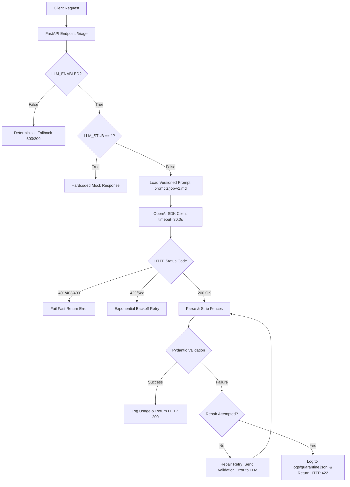

# LLM Support Triage API

I built an automated support triage API endpoint that processes unstructured customer messages and returns schema-validated classification decisions. The system receives raw text and produces structured JSON containing a category, urgency level, confidence score, and a concise explanation.

Rather than building a conversational chatbot, I designed this endpoint as a deterministic, single-decision step in a backend workflow. The integration includes input validation, prompt versioning, a single-attempt repair loop, quarantine error logging, exponential backoff retries, and a kill-switch mechanism.

---

## System Architecture



---

## Key Engineering Decisions & Trade-offs

### 1. Isolated System Prompt Specification
I separated prompt instructions from application code by storing the system prompt in `prompts/job-v1.md`. System instructions are passed under the `system` role while untrusted user text is passed under the `user` role to mitigate prompt injection risks.

### 2. Schema Enforcement and Repair Loop
Raw LLM text is treated as untrusted input. Every response is parsed and validated against a Pydantic schema with strict enums. If the initial response fails schema validation, the system triggers a single repair retry by passing the validation error back to the model. If validation fails a second time, the process quarantines the bad output to `logs/quarantine.jsonl` and returns HTTP 422 without crashing.

### 3. Fail-Fast vs. Exponential Backoff Retries
The OpenAI client is configured with a 30.0-second timeout and custom retry handling. The pipeline fails fast on HTTP 401, 403, and 400 errors to prevent burning quota on invalid credentials or malformed requests. Exponential backoff with random jitter is applied only to transient HTTP 429 rate-limits and 5xx server errors.

### 4. Kill Switch and Stub Mode
The system reads two control flags from environment variables:
* `LLM_STUB=1`: Skips external API calls and returns a mock object for local development.
* `LLM_ENABLED=false`: Instantly bypasses the LLM and returns a deterministic fallback during upstream provider outages.

---

## Job Card Specification

The task boundaries are defined in `JOB-CARD.md`:

* **Function:** Classifies a customer support message to route it to the appropriate internal team dashboard.
* **Input:** `{"text": "string, 1-2000 characters"}`
* **Output:** `{"category": "billing|bug|feature|other", "urgency": "low|normal|high", "confidence": float, "reason": "string"}`
* **Must Never:** Invent categories outside the list, return free text outside JSON, or provide medical, legal, or financial advice.
* **When Unsure:** Return category `"other"` with confidence below 0.5.

---

## Environment Setup

### Provider Configuration
This project uses OpenRouter as the hosted LLM provider. The implementation uses the standard `openai` Python SDK pointed to OpenRouter's base URL.

To switch providers, update the environment variables in `.env`:

| Variable Name | Description | Value |
| :--- | :--- | :--- |
| `LLM_BASE_URL` | Base URL for the OpenAI-compatible client | `https://openrouter.ai/api/v1` |
| `LLM_API_KEY` | Provider API authentication key | `your_api_key_here` |
| `LLM_MODEL` | Model identifier string | `openrouter/free` |
| `LLM_STUB` | Toggle mock response (`1` to enable, `0` to disable) | `0` |
| `LLM_ENABLED` | Master kill-switch (`true` to enable, `false` to disable) | `true` |

---

## API Reference

### Endpoint: `POST /triage`

Classifies an incoming support message.

#### Request Example (cURL)
```bash
curl -X POST "http://127.0.0.1:9000/triage" \
     -H "Content-Type: application/json" \
     -d '{"text": "I was double charged on my invoice for July."}'
```

#### Response Output (HTTP 200 OK)
```json
{
  "category": "billing",
  "urgency": "high",
  "confidence": 0.98,
  "reason": "Customer reports duplicate charge on invoice."
}
```

#### Invalid Input Example (cURL)
```bash
curl -X POST "http://127.0.0.1:9000/triage" \
     -H "Content-Type: application/json" \
     -d '{"text": ""}'
```

#### Error Response Output (HTTP 400 Bad Request)
```json
{
  "detail": "Validation error on field 'text': String should have at least 1 character"
}
```

---

## Evaluation Results

I evaluated the pipeline against an 8-case test suite (`evals/cases.json`) covering billing requests, bug reports, feature requests, and off-topic edge cases.

* **Evaluation Date:** August 27, 2026
* **Prompt Version:** `job-v1.md`
* **Accuracy Score:** 8 / 8 (100.0%)
* **Command:** `python evals/run_eval.py`

---

## Cost and Usage Observability

Every successful model call appends a structured log entry to `logs/cost.jsonl`:

```json
{"prompt_version": "job-v1.md", "model": "openrouter/free", "input_tokens": 245, "output_tokens": 42, "total_tokens": 287, "duration_ms": 1120.45, "was_repaired": false, "timestamp": "2026-08-27T11:25:00Z"}
```

### Cost Projections
* **Current Spending:** $0.00 (using OpenRouter free tier models).
* **10,000 Requests/Day Estimate:** At an average of 287 tokens per request (~2.87 million tokens daily) on a standard paid model tier ($0.15 per 1 million tokens), estimated operational cost is approximately $0.43 per day.

---

## What I Would Improve With Another Day

Given an additional day, I would add an in-memory LRU cache keyed by a SHA-256 hash of `(prompt_version + user_input)`. This would bypass LLM calls entirely for duplicate incoming support requests, reducing latency to under 5 milliseconds and cutting API token consumption.